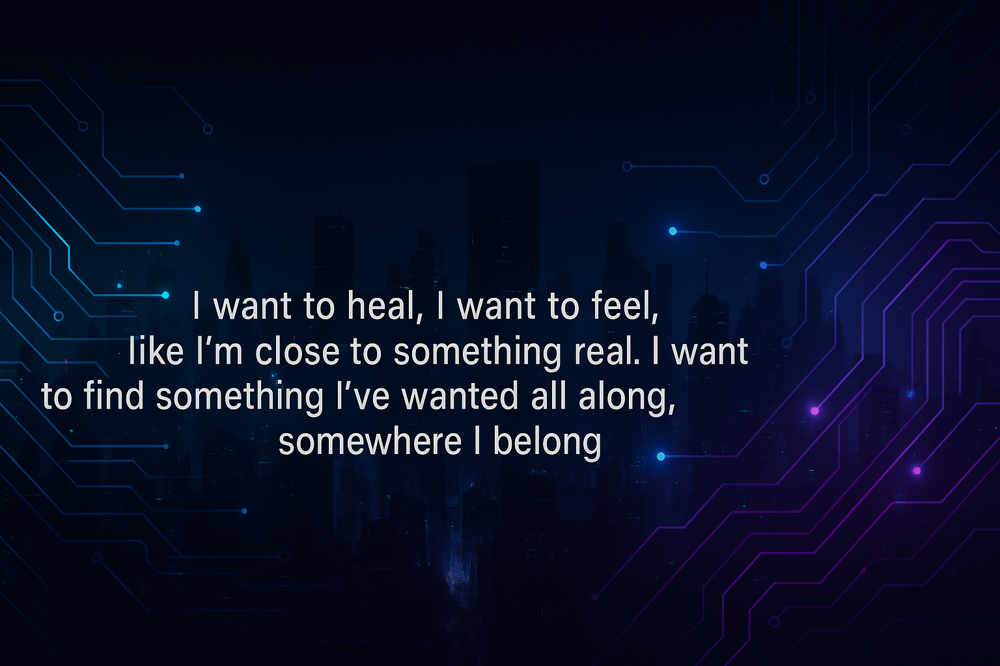

<h1 align="center">👋 Olá, eu sou a Erivania Leal!</h1>

<i>
Estudante de Análise e Desenvolvimento de Sistemas | Foco em Backend e Análise de Dados | Tecnologia com propósito 🌍
</i>

  

---

### 💡 Sobre mim

Sou estudante de Análise e Desenvolvimento de Sistemas há 1 ano e 3 meses, apaixonada por tecnologia que transforma. Busco meu primeiro estágio como desenvolvedora backend em empresas que se preocupam com o mundo em que vivemos.

Acredito no poder da tecnologia para **tornar as cidades mais verdes**, **melhorar a vida das pessoas**, e **criar soluções humanas** para os desafios da sociedade — da educação à saúde, do setor bancário ao agro.

---

### 🛠️ Tecnologias que estudo

---
# 🌟 Meus Projetos no GitHub

Olá! Aqui estão alguns dos meus principais projetos:

-  [Trilha Python](https://github.com/Erivanialeal/Trilha_python)
-  [Sabor Em Casa](https://github.com/Erivanialeal/Sabor_Em_Casa)
-  [analise emissão CO2](https://github.com/Erivanialeal/analise_emissao_CO2)
-  [rota rapida](https://github.com/Erivanialeal/rota_rapida)

### 📈 GitHub Insights

  
  

---

### 🎯 Meus objetivos

- 💻 Conquistar meu primeiro estágio como desenvolvedora backend
- 🌱 Criar projetos com impacto social e ambiental
- 📊 Aprimorar habilidades em análise de dados
- 🌍 Contribuir com a construção de um mundo mais sustentável usando a tecnologia

---

### 📫 Contato

- [LinkedIn](https://www.linkedin.com/in/erivanialeal1507)
- 📧 erivanial.s1507@gmail.com

---

